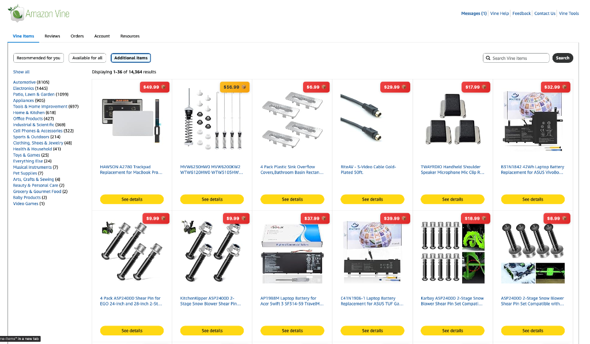

# Amazon Vine Price Display - Userscript Version

This is a userscript version of the Amazon Vine Price Display extension. It works with Tampermonkey, Violentmonkey, or Greasemonkey.

## Installation

1. **Install a userscript manager:**
   - **Tampermonkey**: [Chrome](https://chrome.google.com/webstore/detail/tampermonkey/dhdgffkkebhmkfjojejmpbldmpobfkfo) | [Firefox](https://addons.mozilla.org/en-US/firefox/addon/tampermonkey/) | [Safari](https://apps.apple.com/us/app/tampermonkey/id1482490089)
   - **Violentmonkey**: [Chrome](https://chrome.google.com/webstore/detail/violentmonkey/jinjaccalgkegednnccohejagnlnfdag) | [Firefox](https://addons.mozilla.org/en-US/firefox/addon/violentmonkey/)
   - **Greasemonkey**: [Firefox](https://addons.mozilla.org/en-US/firefox/addon/greasemonkey/)
   - **Userscripts**: [Safari (iOS/macOS)](https://apps.apple.com/us/app/userscripts/id1463298887)

2. **Install the script:**
   - Open `amazon-vine-price-display.user.js` in a text editor
   - Copy the entire contents
   - Open your userscript manager (Tampermonkey/Violentmonkey/Greasemonkey)
   - Click "Create a new script" or "Add new script"
   - Paste the code
   - Save the script (Ctrl+S / Cmd+S)

3. **Verify installation:**
   - Navigate to `https://vine.amazon.com` or `https://www.amazon.com/vine/`
   - You should see a "Vine Tools" link in the header navigation
   - Price badges should appear on Vine items

## Screenshots

*Color-coded price badges on Amazon Vine items*

## Features

- **Price Display**: Shows product prices on Amazon Vine items with color-coded badges
  - 🟢 Green: High value items (default: $90+)
  - 🟡 Yellow: Medium value items (default: $50-$89.99)
  - 🔴 Red: Lower value items (below $50)
- **Customizable Price Ranges**: Set custom minimum prices for each color category
- **Caching**: Caches prices for 7 days to avoid repeated fetches
- **Cache Indicator**: Shows 📦 icon for cached prices
- **Saved Searches**: Save your favorite search terms for quick 1-click access
- **Settings UI**: Access settings from the "Vine Tools" link in the header navigation
- **Hide Cached Items**: Toggle to hide items you've already viewed
- **Auto-updates**: Automatically processes new items as you scroll

## Usage

1. **Access Settings**: Click the "Vine Tools" link in the header navigation on any Amazon Vine page
2. **Saved Searches**: Use the "Saved Searches" tab to add and manage your favorite search terms
3. **Configure Price Ranges**: Set custom minimum prices for Green, Yellow, and Red categories in the "Price Settings" tab
4. **Hide Cached Items**: Toggle the checkbox to hide items you've already viewed (cached prices)
5. **Clear Cache**: Click "Clear Cache" to remove all cached prices if needed

## How It Works

The script extracts product ASINs from Vine item links, checks a local cache first, and if not cached, fetches the product page HTML to extract the price. Prices are parsed from multiple CSS selectors to handle different Amazon page layouts. The script uses `GM_xmlhttpRequest` (with localStorage fallback) for cross-origin requests and storage.

## Browser Compatibility

- ✅ Chrome/Edge (with Tampermonkey or Violentmonkey)
- ✅ Firefox (with Tampermonkey, Violentmonkey, or Greasemonkey)
- ✅ Safari (with Tampermonkey or Userscripts)
- ✅ Opera (with Tampermonkey or Violentmonkey)

## Troubleshooting

- **Prices not showing**: Make sure the script is enabled in your userscript manager
- **Settings link not visible**: Check that you're on an Amazon Vine page (`vine.amazon.com` or `amazon.com/vine/*`). The script will automatically add the link when the page loads.
- **Cache not working**: Check browser console for errors (F12)

## Notes

- The script runs on both `vine.amazon.com` and `www.amazon.com/vine/*`
- Prices are cached for 7 days
- Maximum cache size is 1000 items (oldest entries are removed automatically)
- The script uses `GM_xmlhttpRequest` to fetch prices (with localStorage fallback for storage)
- Compatible with userscript managers that don't support all GM APIs (automatic fallbacks included)
- Settings are stored locally using GM storage API or localStorage as fallback
