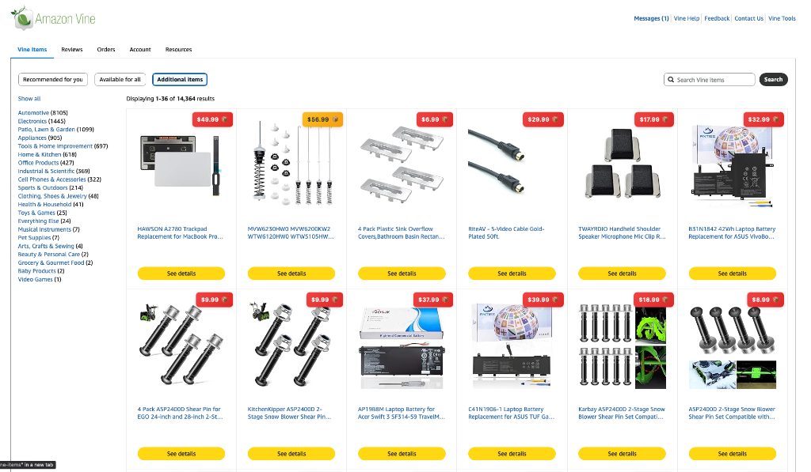

# Amazon Vine Price Display - Userscript Version

This is a userscript version of the Amazon Vine Price Display extension. It works with Tampermonkey, Violentmonkey, or Greasemonkey.

## Installation

1. **Install a userscript manager:**
   - **Tampermonkey**: [Chrome](https://chrome.google.com/webstore/detail/tampermonkey/dhdgffkkebhmkfjojejmpbldmpobfkfo) | [Firefox](https://addons.mozilla.org/en-US/firefox/addon/tampermonkey/) | [Safari](https://apps.apple.com/us/app/tampermonkey/id1482490089)
   - **Violentmonkey**: [Chrome](https://chrome.google.com/webstore/detail/violentmonkey/jinjaccalgkegednnccohejagnlnfdag) | [Firefox](https://addons.mozilla.org/en-US/firefox/addon/violentmonkey/)
   - **Greasemonkey**: [Firefox](https://addons.mozilla.org/en-US/firefox/addon/greasemonkey/)
   - **Userscripts**: [Safari (iOS/macOS)](https://apps.apple.com/us/app/userscripts/id1463298887)

2. **Install the script:**
   - Open `amazon-vine-price-display.user.js` in a text editor
   - Copy the entire contents
   - Open your userscript manager (Tampermonkey/Violentmonkey/Greasemonkey)
   - Click "Create a new script" or "Add new script"
   - Paste the code
   - Save the script (Ctrl+S / Cmd+S)

3. **Verify installation:**
   - Navigate to `https://vine.amazon.com` or `https://www.amazon.com/vine/`
   - You should see a "Vine Tools" link in the header navigation
   - Price badges should appear on Vine items

## Screenshots

*Color-coded price badges on Amazon Vine items*

## Features

- **Price Display**: Shows product prices on Amazon Vine items with color-coded badges
  - 🟢 Green: High value items (default: $90+)
  - 🟡 Yellow: Medium value items (default: $50-$89.99)
  - 🔴 Red: Lower value items (below $50)
- **Color Filter**: Filter items by price range with convenient checkboxes (right-aligned, compact design)
  - Show/hide green, yellow, and red items in any combination
  - Filter bar stays visible while scrolling (sticky positioning)
  - Settings persist across sessions
- **AI Review Generator**: Generate high-quality Amazon Vine reviews using AI
  - **Works on ALL Amazon product pages** (not just Vine items)
  - **Also works on review creation pages** - generate reviews directly while writing
  - Powered by OpenAI, DeepSeek, or Claude (Anthropic) — selectable in Settings
  - Follows Vine Voice guidelines (unbiased, honest, insightful)
  - Customizable with star rating and your own comments
  - One-click copy to clipboard
  - Appears automatically on product pages and review forms
- **Customizable Price Ranges**: Set custom minimum prices for each color category
- **Caching**: Caches prices for 7 days to avoid repeated fetches
- **Unavailable Prices**: Remembers seen items even when Amazon exposes no reliable price, displays a "Price unavailable" badge, and retries the lookup after 12 hours
- **Cache Indicator**: Shows 📦 icon for cached prices
- **Saved Searches**: Save your favorite search terms for quick 1-click access, with the ability to reorder them
- **Cloud Sync**: Sign in with Google to sync your price cache, saved searches, and keywords between devices
- **Keyboard Shortcuts**: Navigate faster with keyboard shortcuts—double-tap V to open tools, ESC to close, arrow keys for pagination
- **Settings UI**: Access settings from the "Vine Tools" link in the header navigation
- **Hide Cached Items**: Toggle to hide items you've already viewed
- **Auto-Advance Pages**: Automatically skip to the next page when all items are hidden (requires "Hide Cached Items" to be enabled)
- **Multi-Variant Listings**: Parent-ASIN tiles resolve the variations Vine actually offers (via the Vine API), showing their ETV or a price range instead of the default child's buybox price
- **Keyword Lists**: Highlight items matching your interest keywords; hide items matching block keywords (cloud-synced)
- **Sort by Price**: Reorder the items grid low-to-high or high-to-low from the filter bar
- **Infinite Scroll**: Optionally load the next page inline as you near the bottom
- **Stats Dashboard**: Cache size/age, items seen, and a price histogram in Vine Tools
- **Price-Check Links**: Keepa / CamelCamelCamel / Google links on every price badge
- **Auto-updates**: Automatically processes new items as you scroll

## Usage

1. **Color Filter**: Use the checkboxes at the top of the grid to filter items by price range (green/yellow/red)
2. **AI Review Generator**: On product pages, use the AI generator to create
   reviews (requires an API key for your chosen provider in Settings). On
   Amazon's review page, **Generate Review** fills the title, body, and selected
   star rating then collapses the panel; **Generate and Submit** performs the
   same checks, clicks Amazon's Submit button only when every field succeeds,
   and collapses the panel after initiating submission
3. **Access Settings**: Click the "Vine Tools" link in the header navigation on any Amazon Vine page
4. **Saved Searches**: Use the "Saved Searches" tab to add, rename (click ✏️), delete (click 🗑️ twice), and reorder (drag the ⋮⋮ handle) your favorite search terms
5. **Configure Price Ranges**: Set custom minimum prices for Green, Yellow, and Red categories in the "Price Settings" tab
6. **AI Provider**: Select OpenAI, DeepSeek, or Claude in "Price Settings" and add the corresponding API key to enable AI review generation
7. **Hide Cached Items**: Toggle the checkbox to hide items you've already viewed (cached prices)
8. **Auto-Advance Pages**: Enable this option to automatically advance to the next page when all items on the current page are hidden (only works when "Hide Cached Items" is enabled)
9. **Cloud Sync**: Open the "Cloud Sync" tab, connect with Google once per device, and click "Sync Now"
10. **Migrate GitHub Sync**: After connecting, use **Import legacy Gists** once. The script detects the previously saved token or accepts it temporarily, merges all old sync data, and removes the local GitHub credentials after success.
11. **Clear Cache**: Click "Clear Cache" to remove all cached prices if needed
12. **Keyboard Shortcuts**: Press **V twice quickly** to open Vine Tools, **ESC** to close modals, **←/→** for page navigation

### Keyboard Shortcuts

- **V V (double-tap)**: Open/Close Vine Tools modal (press V twice within 500ms)
- **Escape**: Close any open modal (including the AI Review Generator)
- **1**: Toggle Hide Cached filter
- **4**: Toggle Green filter (🟢 $90+ items)
- **5**: Toggle Yellow filter (🟡 mid-range items)
- **6**: Toggle Red filter (🔴 low-value items)
- **← (Left Arrow)**: Go to previous page
- **→ (Right Arrow)**: Go to next page

Filter and pagination shortcuts are ignored while the Vine Tools modal is open, so typing or clicking inside the modal can't change filters on the page behind it.

## How It Works

The script extracts product ASINs from Vine item links, checks a local cache first, and if not cached, fetches the product page HTML to extract the price. Prices are parsed from multiple CSS selectors to handle different Amazon page layouts. The script uses `GM_xmlhttpRequest` (with localStorage fallback) for cross-origin requests and storage.

## Browser Compatibility

- ✅ Chrome/Edge (with Tampermonkey or Violentmonkey)
- ✅ Firefox desktop and Android
  (with Tampermonkey, Violentmonkey, or Greasemonkey)
- ✅ Safari (with Tampermonkey or Userscripts)
- ✅ Opera (with Tampermonkey or Violentmonkey)

## Cloud Sync Setup (Optional)

Cloud Sync uses Google login through Supabase. No personal access token or new
password is required:

1. Open **Vine Tools** on an Amazon Vine page.
2. Select **Cloud Sync** and click **Connect with Google**.
3. Complete the secure sign-in window.
4. Click **Sync Now**. Future syncs run automatically at a throttled interval.

The price cache, saved searches, and keyword lists are synchronized. You can
also opt in to encrypted AI-key sync: choose a passphrase of at least 12
characters and enter the same passphrase on every device. The passphrase is
never stored or uploaded, so it cannot be recovered. Amazon cookies and other
local settings never leave the device. Use **Disconnect** to revoke this
browser's sync session.

Existing GitHub Gist users can migrate without exporting JSON manually. Connect
to Cloud Sync, enter the old token if it was not detected automatically, and
click **Import legacy Gists**. The importer finds the three Vine Gists, merges
them with local and Supabase data, and removes the token and saved Gist IDs from
this browser after a successful import. It does not modify or delete the Gists;
keep them until the migrated data has been verified, then revoke the old token.

Repository owners must configure the Supabase project before distributing a
build. See [`docs/supabase-sync-setup.md`](docs/supabase-sync-setup.md).

## Troubleshooting

- **Prices not showing**: Make sure the script is enabled in your userscript manager
- **Settings link not visible**: Check that you're on an Amazon Vine page (`vine.amazon.com` or `amazon.com/vine/*`). The script will automatically add the link when the page loads.
- **Cache not working**: Check browser console for errors (F12)

## Notes

- The script runs on both `vine.amazon.com` and `www.amazon.com/vine/*`
- Prices are cached for 7 days
- Maximum cache size is 1000 items (oldest entries are removed automatically)
- The script uses `GM_xmlhttpRequest` to fetch prices (with localStorage fallback for storage)
- Compatible with userscript managers that don't support all GM APIs (automatic fallbacks included)
- Settings are stored locally using GM storage API or localStorage as fallback
- Cloud Sync rows are isolated by the signed-in user through Supabase Row Level Security
